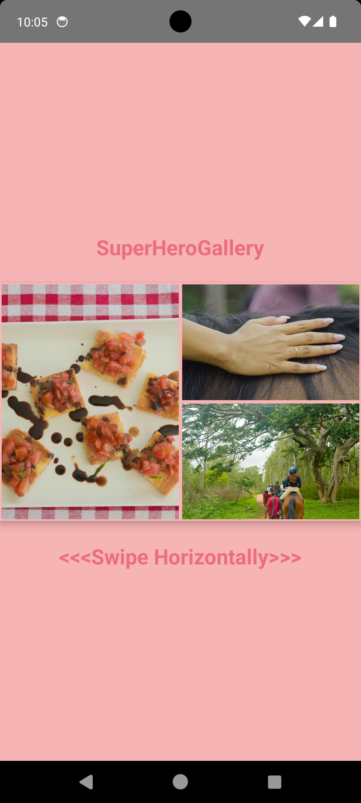
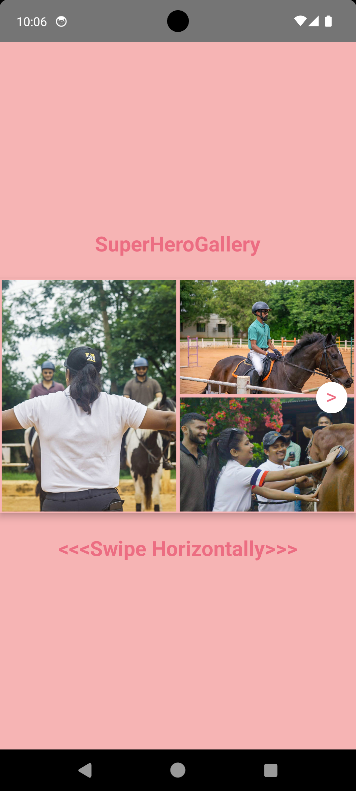
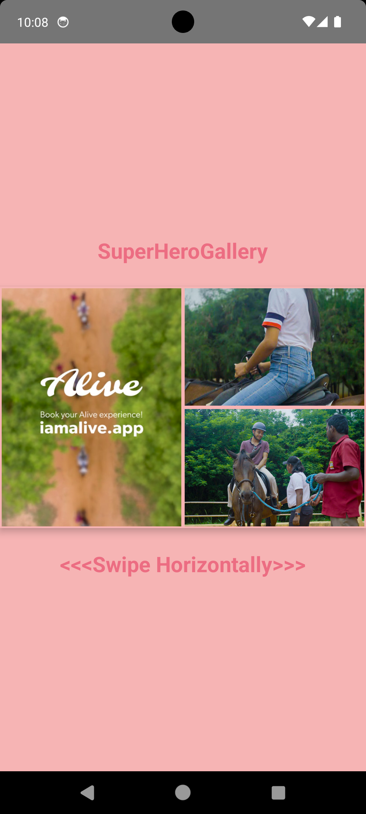

# SuperHeroGalleryAlive

This is a React Native project showcasing a smart, horizontally scrollable hero gallery.

# Getting Started

> **Note**: Make sure you have completed the [Set Up Your Environment](https://reactnative.dev/docs/set-up-your-environment) guide before proceeding.

## Installation

Clone the repository and install the dependencies.

```sh
git clone <repository-url>
cd SuperHeroGalleryAlive
yarn install
```

## Running the app

### Start Metro

First, you will need to run **Metro**, the JavaScript build tool for React Native.

```sh
yarn start
```

### Build and run your app

With Metro running, open a new terminal window/pane from the root of your React Native project, and use one of the following commands to build and run your Android or iOS app:

#### Android

```sh
yarn android
```

#### iOS

For iOS, remember to install CocoaPods dependencies.

```sh
cd ios
bundle install && bundle exec pod install
cd ..
yarn ios
```

If everything is set up correctly, you should see your new app running in the Android Emulator, iOS Simulator, or your connected device.

# Features

The `SuperHeroGallery` component displays a smart, horizontally scrollable gallery of images and videos fetched from an API.

- **Dynamic Page Layout**: The gallery is organized into pages, each with a fixed 2-column layout.
  - **Column 1 (Left)**: One large "hero" tile, preferably a video.
  - **Column 2 (Right)**: Two smaller tiles stacked vertically, preferably images.
- **Smart Media Selection**:
  - A pure function `buildPages` arranges gallery items into pages, prioritizing videos in the hero slot.
  - It selects the video with an aspect ratio closest to 9:16 for the hero tile on each page.
- **Continuous & Performant Scrolling**:
  - Uses a horizontal `FlatList` for smooth scrolling, even with over 100 items.
  - Pages snap into place for a clean user experience.
  - Videos on non-visible pages are paused to save resources.
- **Progressive Loading & Fallbacks**:
  - Images and video posters load progressively (preview -> processed -> original) to enhance performance and handle network errors gracefully.
  - Videos show a poster while downloading and have a "Tap to retry" overlay on playback failure.
- **Interactive Elements**:
  - A "nudge" on the first page encourages users to scroll.
  - Tapping on any item opens a full-screen carousel view with zoom (for images) and navigation controls.

# `buildPages` Logic

The `buildPages` function is a pure, deterministic function that takes an array of gallery items and organizes them into a structured layout of pages.

- **Order Preservation**: It processes the items in the order they are received from the API, aiming to keep the original sequence as much as possible. A `lookahead` parameter allows the function to scan a small subset of upcoming items to find an optimal video without significant reordering.
- **Video Prioritization**: For each page, the function searches for the best video candidate within its lookahead window. The "best" video is the one with an aspect ratio closest to 9:16 (0.5625). This ensures the hero tile is filled with the most suitable video content.
- **Page Filling**: The function then fills the remaining slots on the page with images. If there aren't enough images to fill the two slots in the second column, it will allow the selected video to be placed there to ensure the page is complete.

# Fallbacks and Performance

- **Fallbacks**: The application implements a robust fallback strategy for media assets. It first attempts to load a lightweight preview, then a mobile-processed version, and finally the original high-quality asset. This ensures that the user always sees something, even if higher-quality assets fail to load. For videos, if playback fails, a poster is displayed with a "Tap to retry" option.
- **Performance**:
  - `FlatList`: A horizontal `FlatList` is used for the gallery, which virtualizes the content and only renders items that are currently visible on the screen.
  - `memo`: React's `memo` is used to prevent unnecessary re-renders of gallery tiles and pages.
  - `useCallback`: Callbacks passed to the list items are memoized using `useCallback` to maintain stable references.
  - **Viewability Control**: Video playback is tied to page visibility; videos on pages that are not in view are automatically paused.

# What could be improved with more time?

- **Prefetching**: Implement prefetching for images on the next one or two pages (N+1, N+2) to make the gallery feel even more responsive.
- **Advanced Caching**: Introduce a more sophisticated caching layer to store media assets on the device, reducing network requests on subsequent app uses.
- **More Unit Tests**: Expand the unit tests for `buildPages` to cover more edge cases.
- **Page Indicator**: Add a dot indicator to show the user their current position in the gallery.

# Screenshots

    
